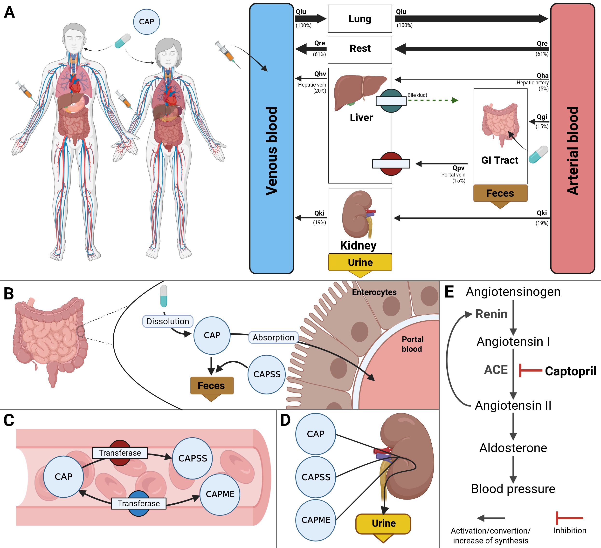

# Captopril model
This repository provides the captopril physiologically based pharmacokinetics/pharmacodynamics (PBPK/PD) model.

The model is distributed as [SBML](http://sbml.org) available from [`captopril_body_flat.xml`](./models/captopril_body_flat.xml) with the COMBINE archive available from [`captopril_model.omex`](./captopril_model.omex).

The model is distributed as [SBML](http://sbml.org) available from [`captopril_body_flat.xml`](./models/captopril_body_flat.xml) with 
corresponding [SBML4humans model](https://sbml4humans.de/model_url?url=https://raw.githubusercontent.com/matthiaskoenig/captopril-model/main/models/captopril_body_flat.xml) and [equations](./models/captopril_body_flat.md).

The COMBINE archive is available from [`captopril_model.omex`](./captopril_model.omex).

### Comp submodels
The liver submodel is available from [`captopril_liver.xml`](./models/captopril_liver.xml) with corresponding [SBML4humans](https://sbml4humans.de/model_url?url=https://raw.githubusercontent.com/matthiaskoenig/captopril-model/main/models/captopril_liver.xml) and [equations](./models/captopril_liver.md).

The kidney submodel is available from [`captopril_kidney.xml`](./models/captopril_kidney.xml) with corresponding [SBML4humans](https://sbml4humans.de/model_url?url=https://raw.githubusercontent.com/matthiaskoenig/captopril-model/main/models/captopril_kidney.xml) and [equations](./models/captopril_kidney.md).

The intestine submodel is available from [`captopril_intestine.xml`](./models/captopril_intestine.xml) with corresponding [SBML4humans](https://sbml4humans.de/model_url?url=https://raw.githubusercontent.com/matthiaskoenig/captopril-model/main/models/captopril_intestine.xml) and [equations](./models/captopril_intestine.md).

The RAAS submodel is available from [`captopril_raas.xml`](./models/captopril_raas.xml) with corresponding [SBML4humans](https://sbml4humans.de/model_url?url=https://raw.githubusercontent.com/matthiaskoenig/captopril-model/main/models/captopril_raas.xml) and [equations](./models/captopril_raas.md).

The whole-body submodel is available from [`captopril_body.xml`](./models/captopril_body.xml) with corresponding [SBML4humans report](https://sbml4humans.de/model_url?url=https://raw.githubusercontent.com/matthiaskoenig/captopril-model/main/models/captopril_body.xml) and [equations](./models/captopril_body.md).

## How to cite

> Myshkina, M., & König, M. (2025).
> *Physiologically based pharmacokinetic/pharmacodynamic (PBPK/PD) model of captopril.*   
> Zenodo. [https://doi.org/10.5281/zenodo.17091694](https://doi.org/10.5281/zenodo.17091694)

## License

* Source Code: [MIT](https://opensource.org/license/MIT)
* Documentation: [CC BY-SA 4.0](https://creativecommons.org/licenses/by-sa/4.0/)
* Models: [CC BY-SA 4.0](https://creativecommons.org/licenses/by-sa/4.0/)

This program is distributed in the hope that it will be useful, but WITHOUT ANY
WARRANTY; without even the implied warranty of MERCHANTABILITY or FITNESS FOR A
PARTICULAR PURPOSE.

## Funding
Matthias König was supported by the Federal Ministry of Education and Research (BMBF, Germany) within LiSyM by grant number 031L0054 and ATLAS by grant number 031L0304B and by the German Research Foundation (DFG) within the Research Unit Program FOR 5151 QuaLiPerF (Quantifying Liver Perfusion-Function Relationship in Complex Resection - A Systems Medicine Approach) by grant number 436883643 and by grant number 465194077 (Priority Programme SPP 2311, Subproject SimLivA). This work was supported by the BMBF-funded de.NBI Cloud within the German Network for Bioinformatics Infrastructure (de.NBI) (031A537B, 031A533A, 031A538A, 031A533B, 031A535A, 031A537C, 031A534A, 031A532B). 

© 2025 Mariia Myshkina and Matthias König, [Systems Medicine of the Liver](https://livermetabolism.com)